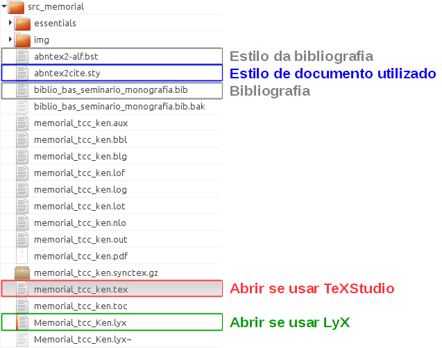

<h1>Extração, classificação e reconhecimento de padrões de informações contidas em artigos acadêmicos utilizando mineração web de conteúdo e mineração web de uso </h1>
## 1. Memorial de Monografia
### Autores
<table>
  <tbody>
    <tr>
      <td><strong>Orientador</strong></td>
      <td>Prof. Me. Fernando Rodrigues</td>
    </tr>
    <tr>
      <td><strong>Corientador</strong></td>
      <td>Prof. Dr. Márcio Amora</td>
    </tr>
    <tr>
      <td><strong>Colaborador</strong></td>
      <td>Prof. Dr. Jarbas Joací</td>
    </tr>
    <tr>
      <td><strong>Discente</strong></td>
      <td>Ken Esparta Ccorahua</td>
    </tr>
  </tbody>
</table>

## 2. Estrutura das pastas
### 2.1. Árvore de pastas principal

```
.
├── ess_img [IMAGENS DO GITHUB]
├── saida_pdf [ARQUIVO GERADO EM PDF]
└── src_memorial
    ├── essentials [PASTA DE CRIAÇÃO DAS IMAGENS]
    └── img [IMAGENS DO MEMORIAL]
```
### 2.2. Como abrir no TexStudio ou no Eclipse?
<p>
  Abrir o arquivo <b style="color:rgb(50,150,25)">memorial_tcc_ken.tex</b> se utilizar o  <a href="http://www.texstudio.org/">TeXStudio</a> ou o arquivo arquivo <b style="color:rgb(255,0,0)">Memorial_tcc_Ken.lyx</b> se utilizar o <a href="http://www.lyx.org/">LyX</a>.
</p>

